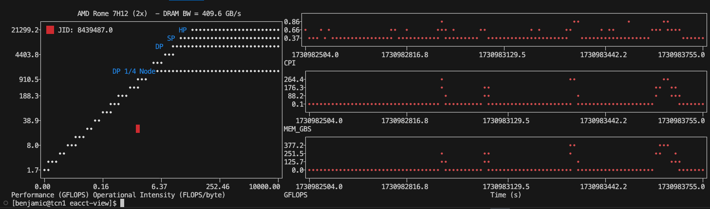

# eacct-view
Terminal plotting tool for energy aware runtime (EAR)



## Build instructions

```
git clone https://github.com/sara-nl/eacctview.git
cd eacctview
pip install .
```

### Requirements
- numpy
- plotext https://github.com/piccolomo/plotext/tree/master
- Energy Aware Runtime (EAR) https://gitlab.bsc.es/ear_team/ear (Not installed with setup.py!!)

## Usage
```
usage: eacctview [-h] [-j JobID] [--metrics Metrics [Metrics ...]] [--list-metrics] [--list-architectures]

optional arguments:
  -h, --help            show this help message and exit
  -j JobID, --jobid JobID
                        Plot Roofline and Timeline from eacct tool
  --metrics Metrics [Metrics ...]
                        Metrics to plot timeline
  --list-metrics        List available metrics to plot timeline
  --list-architectures  List the specs for the available archs
  ```

## Simple example
Pass it a jobid and stepid of a job that you ran with the EAR runtime library enabled, i.e. `--ear=on`. It doesn't matter the policy.
```
eacctview -j 9572777.1
```