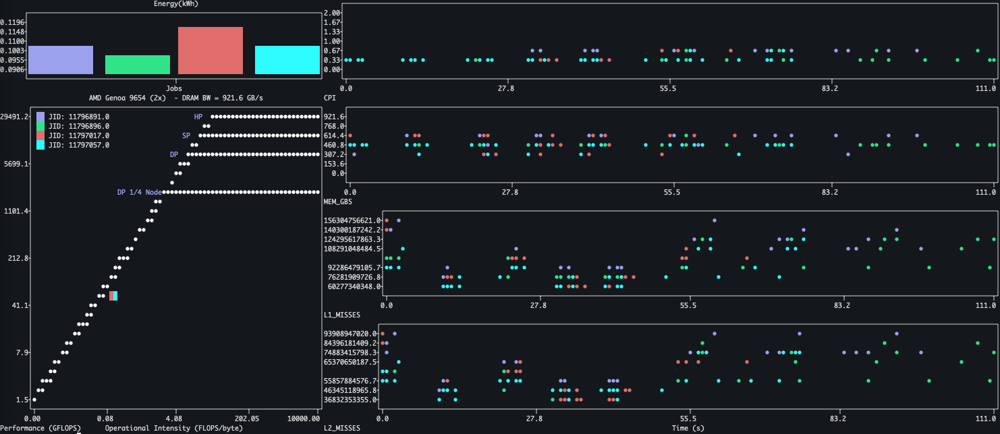
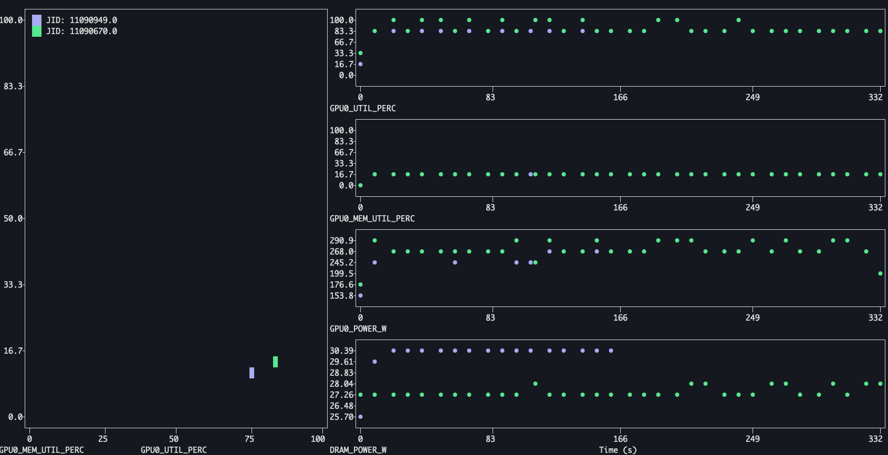

# eacct-view
Terminal plotting tool for energy aware runtime (EAR)



## Build instructions

```
git clone https://github.com/sara-nl/eacctview.git
cd eacctview
pip install .
```

### Requirements
- numpy
- plotext https://github.com/piccolomo/plotext/tree/master
- Energy Aware Runtime (EAR) https://gitlab.bsc.es/ear_team/ear (Not installed with setup.py!!)

## Usage
```
usage: eacctview [-h] [-j JobID/s [JobID/s ...]] [-c csv] [--xvy-metrics METRIC_STRING METRIC_STRING] [--time-metrics METRIC_STRING/S [METRIC_STRING/S ...]]
                 [--list-metrics] [--list-architectures]

optional arguments:
  -h, --help            show this help message and exit
  -j JobID/s [JobID/s ...], --jobid JobID/s [JobID/s ...]
                        Plot Roofline and Timeline from eacct tool
  -c csv, --csv csv     Plot Roofline and Timeline from csvfile
  --xvy-metrics METRIC_STRING METRIC_STRING
                        2D metric v metric plot
  --time-metrics METRIC_STRING/S [METRIC_STRING/S ...]
                        Metrics to plot timeline
  --list-metrics        List available metrics to plot timeline
  --list-architectures  List the specs for the available archs
```

## Simple example
Pass it a jobid and stepid of a job that you ran with the EAR runtime library enabled, i.e. `--ear=on`. It doesn't matter the policy.
```
eacctview -j 9572777.1
```

In order for a timeline to be visible you need to run a job with the environment variable enabled `export EARL_REPORT_LOOPS=1`

Example Slurm jobscript addtions would be:
```
#SBATCH --ear=on
#SBATCH --ear-policy=monitoring

export EARL_REPORT_LOOPS=1
```

## Customize the timeline metrics that you plot
You can list the available metrics that can be plotted via:
```
eacctview --list-metrics
```
And to plot speccific ones (GPU metrics from NVML for example....)
```
eacctview -j 12345678 --time-metrics GPU0_UTIL_PERC GPU0_MEM_UTIL_PERC GPU0_POWER_W GFLOPS
```

## Compare two jobs
Just add another job id...
```
eacctview -j 9572777.1 9572454.1
```

## Plot job average Metric vs Metric (insead of roofline)
```
eacctview -j 12345678 --xvy-metrics GPU0_UTIL_PERC GPU0_MEM_UTIL_PERC
```


### Putting it all together:

```
eacctview -j 11090949 11090670 --time-metrics GPU0_UTIL_PERC GPU0_MEM_UTIL_PERC GPU0_POWER_W DRAM_POWER_W --xvy-metrics GPU0_UTIL_PERC GPU0_MEM_UTIL_PERC
```




